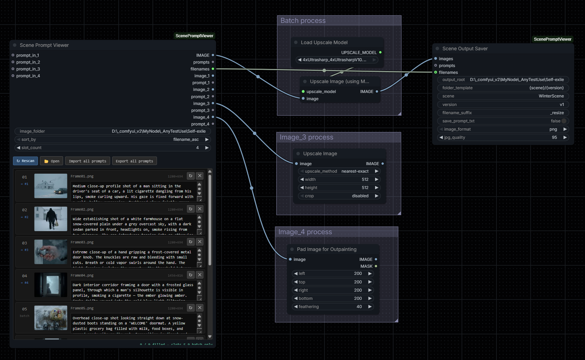

# ComfyUI Scene Prompt Viewer

A ComfyUI custom node that lets you load a folder of images, preview each one with its own editable prompt directly on the node, batch process them through any downstream workflow, and save the results using the original filenames.



## Nodes

- **Scene Prompt Viewer** — main node
Scans a folder and shows a card per image. Outputs IMAGE batch, prompts, and filenames. Use `slot_count` to expose individual `image_N` / `prompt_N` sockets for per-image handling.

- **Scene Output Saver** — output node, designed to pair with Scene Prompt Viewer
Receives the IMAGE batch and filenames, builds a subfolder from your template, and saves each file using its original name.

- **Scene Prompt Text** — helper node
A multiline text input for feeding longer prompts into `prompt_in_N` overrides.


---

## Use cases

- **Batch image processing with original filenames preserved**

Send a whole folder through any processing node. Results are saved with the same filenames as the source — not sequential numbers.

```
Scene Prompt Viewer → image processing → Scene Output Saver
```
> When using individual sockets for single-image processing, the built-in Save Image node with a manually typed filename is simpler than Scene Output Saver, which is designed for batch use.


- **Visual library browser with individual handling**

See your entire image folder at a glance without opening multiple Load Image nodes. Use `slot_count` to pull out specific images into separate downstream workflows — all within the same node.

> Tip: `prompts` outputs all prompts joined by newline. To split them per image, pair with a string-split node from your installed packs.


## Install

```bash
cd ComfyUI/custom_nodes
git clone https://github.com/<your-username>/Comfyui-ScenePromptViewer.git
```

Restart ComfyUI. All nodes appear under **image → utils**.


## Quick start

1. Drop **Scene Prompt Viewer** onto the canvas, paste your image folder path, click **↻ Rescan**
2. Write a prompt on each card if needed
3. Connect `IMAGE` → your processing nodes → **Scene Output Saver**; connect `filenames` directly to Scene Output Saver
4. Set `scene` and `version` in Scene Output Saver, then Queue

---

## Scene Prompt Viewer


#### Toolbar

| Button | Action |
|--------|--------|
| ↻ Rescan | Re-scan folder, restore hidden scenes |
| 📂 Open | Open folder in file explorer |
| Import all prompts | Fill all cards from a pasted block |
| Export all prompts | Copy all prompts to clipboard |

#### Per-card buttons

| Button | Action |
|--------|--------|
| ↻ | Reload this card's thumbnail |
| ✕ | Hide this scene for the session (Rescan to restore) |


## Scene Output Saver


#### Settings

| Field | Default | Description |
|-------|---------|-------------|
| `output_root` | ComfyUI output folder | Root save directory — accepts any absolute path |
| `folder_template` | `{scene}/{date}_{version}` | Subfolder structure — supports `{scene}` `{date}` `{version}` |
| `scene` | `scene` | Your project or batch name |
| `version` | `v1` | Label for this run |
| `filename_suffix` | _(empty)_ | Appended before the extension — e.g. `_resize` → `WinterScene_resize.png` |

**Example** — `scene = Scene01`, `version = v1`, `filename_suffix = _resize`:
```
ComfyUI/output/Scene01/20260612_v1/
  WinterScene_resize.png
  CityScene_resize.png
  ...
```

> Each run gets its own subfolder by changing `version`. This keeps iterations clearly separated and prevents previous outputs from being overwritten.


## Notes

- Batch output handles any number of images — individual sockets (`slot_count`) go up to 8 for images needing separate treatment
- Recommended batch size is around 20 images for smooth performance
- Only top-level files are scanned, no subfolders
- For VRAM-heavy processing nodes, keep batch sizes manageable to avoid out-of-memory errors

---

MIT License
